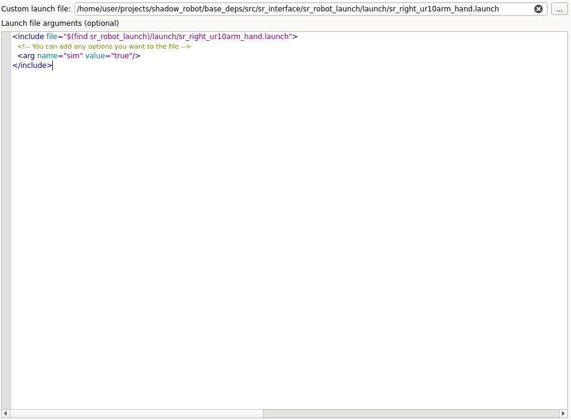
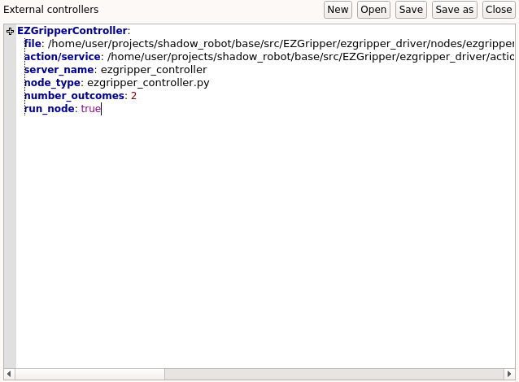

.. _integrate_with_launch:
**************************************
Integrating a robot with a launch file
**************************************

This page contains a step-by-step guide to integrate a robot using an existing launch file.

What you need before starting
#############################

* A `launch file <http://wiki.ros.org/roslaunch>`_ containing the different components to run
* `URDF file <http://wiki.ros.org/urdf/Tutorials/Create%20your%20own%20urdf%20file>`_ of the robot

Prerequisites
#############
| Examples will be provided using the Shadow Dexterous hand mounted on a UR10 robot arm. You can find the corresponding launch file `here <https://github.com/shadow-robot/sr_interface/blob/kinetic-devel/sr_robot_launch/launch/sr_right_ur10arm_hand.launch>`_. Note that you do **not** need to clone anything as everything required is already in the container.

Procedure
#########

1. Start the framework: :code:`roslaunch grip_api start_framework.launch`
2. Set the URDF file and robot's composition
3. Specify your launch file in the corresponding field (you can use the :code:`...` button to browse your file system).
4. An editor allowing you to set the different arguments of your launch file will appear. If you don't have any argument to set, you can skip. Otherwise, each argument should be specified using the following format:

.. code-block:: xml

    <arg name="arg_name" value="value"/>

5. Fill in the different editors that would allow GRIP to communicate with your robot. At least a controller for each robot part needs to be set. In our case we set this controller for the `arm <https://github.com/shadow-robot/sr_interface/blob/kinetic-devel/sr_robot_launch/config/ra_trajectory_controller.yaml>`_ and this one for the `hand <https://github.com/shadow-robot/sr_interface/blob/kinetic-devel/sr_robot_launch/config/rh_trajectory_controller.yaml>`_. Since this launch file already runs MoveIt!, we defined a planner for the group :code:`arm_and_hand`.
6. You can click on the :code:`Launch button` and GRIP should be able to operate your robot.

Important notes
###############
| This integration modality requires some understanding of the components run in the provided launch file.
| In the above example, the launch file was already running MoveIt!, but if yours does not, nothing prevents you to also specify a MoveIt! configuration package.
| If you want GRIP to be able to execute one of the components run in your launch file, make sure they are compatible (i.e. :ref:`wrapped inside a ROS server <wrap_code>`). Once interfaced in the corresponding editor (see :ref:`here <integrate_software>`), you can add :code:`run_node: False` so your method is not launched twice.

