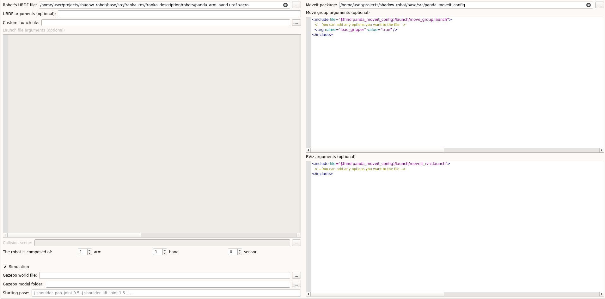
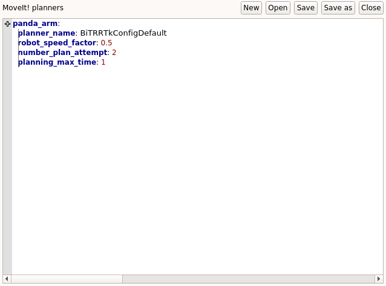

.. _integrate_with_moveit:
********************************
Integrating a robot with MoveIt!
********************************

This page contains a step-by-step guide to integrate a robot using MoveIt!.

What you need before starting
#############################

* A MoveIt! configuration package (if you don't have one, see :ref:`here <creating_moveit_config>`)
* `URDF file <http://wiki.ros.org/urdf/Tutorials/Create%20your%20own%20urdf%20file>`_ of the robot
* :ref:`ROS controllers <ros_controller_file>`

Prerequisites
#############
Examples will be provided using the Franka Panda arm and gripper. If you want to replicate this tutorial, please clone this `repository <https://github.com/ARQ-CRISP/panda_moveit_config>`_, this `repository <https://github.com/ARQ-CRISP/panda_moveit_config>`_ and this `one <https://github.com/ARQ-CRISP/ARQ_common_packages>`_ in :code:`/home/user/projects/shadow_robot/base/src`. Then compile them

.. prompt:: bash $

    cd ..
    sudo apt install ros-kinetic-libfranka
    catkin_make
    source devel/setup.bash

Procedure
#########

Common steps
************
1. Start the framework: :code:`roslaunch grip_api start_framework.launch`
2. Specify the URDF file of the robot to the framework
3. Set the composition of your robot(s), i.e. how many arms, hands and sensors need to be configured
4. Set the path to the MoveIt! configuration package in the corresponding field. You should now see two editors allowing you to provide further configuration options (only if you need to).

5. In each hardware config tab (arm and hand), set the corresponding ROS controllers you want to use.
6. Create (or load) a new motion planner config file for each part of the robot you want to operate with MoveIt!. Once the file is initialized in the editor, click on the + (in the margin) to add a new motion planner config. Follow the different dialogs and add the following information:
    * :code:`planner_name`: Name of the OMPL-integrated planner you want to use. Available ones are listed in the MoveIt! configuration package, see `here <https://github.com/ARQ-CRISP/panda_moveit_config/blob/bdenoun/modify_moveit_package/config/ompl_planning.yaml>`_ for instance.
    * :code:`robot_speed_factor`: Proportion of the maximum speed the robot can achieve. It sets the upper bound. The value must be **smaller or equal to 1 and strictly greater than 0**.
    * :code:`number_plan_attempt`: Number of plans that the motion planner is going to compute before returning a potential solution. **Must be an integer**.
    * :code:`planning_max_time`: Maximum time given to the planner to compute a solution. **In seconds**.

At this point, you should not be able to launch the robot yet. In fact, some steps differ whether you want to run your robot in simulation or not. Let's go over them.

Simulation
**********
| First, make sure to :ref:`set the simulation parameters <set_simu_param>`.
| Now, for step 5., note that you can theoretically use any ROS controller, even if the physical robot does not support them (e.g. torque control). Changing the type of ROS controller you use, might require several modifications.

ROS controllers
---------------
| As detailed :ref:`here <make_simulation_compatible>`, your URDF file should contain :code:`<transmission>` tags, in which we define what kind of controller actuate each joint.
| For instance the default controller Gazebo is expecting is set to `position controller <https://github.com/ARQ-CRISP/franka_ros/blob/5a44b2dabe4dac9a4ca8c71ea31226daed57df4f/franka_description/robots/panda.transmission.xacro#L18>`_. For this reason, the controllers set during step 5. are this `one <https://github.com/ARQ-CRISP/ARQ_common_packages/blob/master/arq_robots/controllers/panda_arm_position_controller.yaml>`_ and this `one <https://github.com/ARQ-CRISP/ARQ_common_packages/blob/master/arq_robots/controllers/panda_gripper_position_controller.yaml>`_.
| However, if you want to use a torque controller in simulation, change the content of :code:`<transmission>` in the URDF file and use different ROS controller files. For the Franka panda arm, we provide an `example <https://github.com/ARQ-CRISP/ARQ_common_packages/blob/master/arq_robots/controllers/panda_torque_controller.yaml>`_ of ROS controller file describing a torque controller.

.. warning::
    The PID and clamping values set in this file are correct only for simulation (they might even need some fine-tuning). If you want to use the torque controller of the real hardware, you need to find the proper PID values.

MoveIt! package
---------------
In order to avoid any error message **make sure** that the name of the controllers declared in the :code:`controllers.yaml` of your MoveIt! configuration package match with the ROS controller file that you provide to the framework.

Physical robot
**************
| First, make sure to uncheck the :code:`simulation` box in the :code:`Robot interface` tab.
| Now, if you want to run your physical robot (or a part of it, i.e only the arm) using MoveIt!, you must specify a hardware connection file for each part of the robot. This means that your robot must have a ROS `hardware interface <https://github.com/ros-controls/ros_control/wiki/hardware_interface>`_ implemented. For further information about ROS hardware interface, please see this :ref:`resource <hw_interface>`.
| Depending on the implementation of your hardware interface, you might need different parameters, but you will at least need the **IP address of the robot**. Some examples of hardware connection files are provided :ref:`here <example_connection_files>`.

.. note::

	GRIP provides natively a compatible hardware interface for Universal Robot arms.

Testing the integration
#######################
| If everything has been properly configured, you should now have the :code:`Launch robot` button enabled. Click on it (or press :code:`Ctrl+L`). You should soon see either one or two windows appearing. If you are running the robot in simulation mode, you should first see a Gazebo window appearing, and then a `RViz <http://wiki.ros.org/rviz>`_ window. If you are running the real robot, you should only see the latter.
| In the Rviz window, you should see a gizmo that allows you to change the joint state of the robots. In the :code:`MotionPlanning` docker window on the left of the Rviz Window, press on the :code:`Planning` tab, and hit on :code:`Plan and Execute`. You should see your robot moving to the target pose you previously set.

.. image:: ../img/franka_rviz.png
