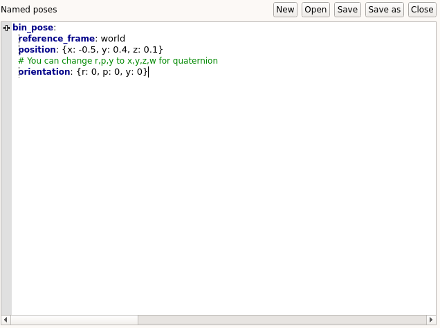
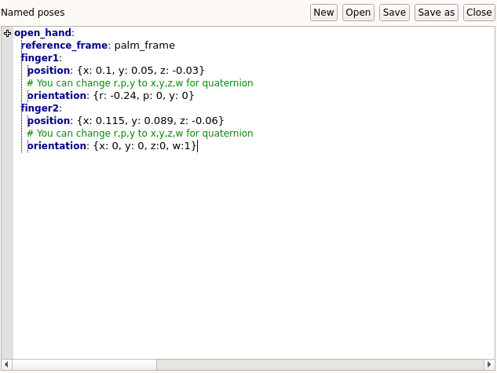

.. _define_poses:
***************************
Defining pre-recorded poses
***************************

This page contains a step-by-step guide to define pre-recorded poses and cartesian poses for robot's end-effector that you can use in the task editor.

Prerequisites
#############
In this tutorial, we assume that a robot is already properly interfaced to GRIP (see :ref:`here <tutorials_list>` for the different integration modalities).

Procedure
#########
The same editor allows you to create both simple poses or to create poses for the robot's end-effector. After completing the common (and mandatory) steps, you can go to the corresponding subsections.

Common steps
************
1. In the :code:`Settings` tab, go to the :code:`Named poses` editor and create a new file by clicking on :code:`New`
2. In the margin, click on the :code:`+` symbol and enter the name of the pose you want to create
3. A template will appear in the editor. Fill in the :code:`reference_frame` field which corresponds to the frame used as the origin of the coordinates you will provide in the next steps

Simple pose
***********
4. Fill in the :code:`position` and :code:`orientation` fields. If you want to declare the rotation of the pose using a quaternion, you can swap the :code:`r`, :code:`p` and :code:`y` keys to :code:`x`, :code:`y`, :code:`z` and :code:`w`

Robot's pose
************
4. Below :code:`reference_frame`, write the name of the end-effector for which you want to define the pose (you can define several). Each end effector **must** have the fields :code:`position` and :code:`orientation`.

.. note::

	Once defined in this editor, you can use the name of the poses in other editors to make things easier (e.g. in :code:`Sensors config` editor). You will also be able to retrieve them in the task editor via their name.
