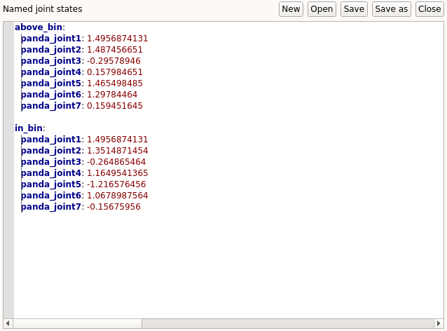

.. _define_traj:
**********************************
Defining pre-recorded trajectories
**********************************

This page contains a step-by-step guide to create pre-recorded trajectories that you can use in the task editor. This is useful to define motions that the robot will repeat (e.g. going from two fixed points in space).

Prerequisites
#############

In this tutorial, we assume that a robot is already properly interfaced to GRIP (see :ref:`here <tutorials_list>` for the different integration modalities).

Procedure
#########
1. In the :code:`Settings` tab, go to the :code:`Named trajectories` editor and create a new file by clicking on :code:`New`
2. In the margin, click on the :code:`+` symbol and enter the name of the trajectory you want to create
3. A template will appear in the editor. Each element is a dictionary allows you to control the *flow* of the trajectory and must contain three fields:
    * :code:`name`: Name of the **joint state** the robot needs to go trough (must be declared in the :code:`Named joint states`)
    * :code:`interpolate_time`: Specifies how long (**in seconds**) the robot will take between the previous waypoint and this one
    * :code:`pause_time`: Specifies how long (**in seconds**) the robot should remain still once the waypoint is reached

.. note::

	The trajectory can contain as many waypoints as required, just make sure there are all defined in :code:`Named joint states`, as detailed :ref:`here <define_js>`.
