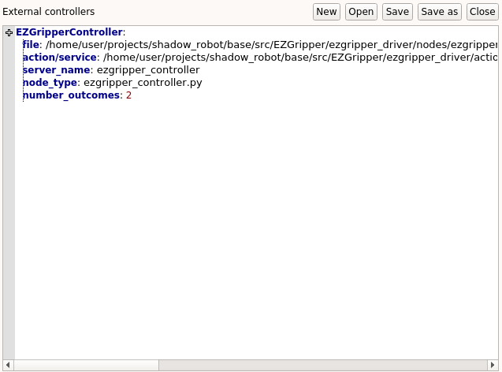

.. _integrate_software:
********************************
Integrating an external software
********************************

This page contains a step-by-step guide to integrate an external software component to GRIP.

What is an external software
############################
| As detailed :ref:`here <integrate_with_moveit>`, you can specify the controller, motion planner and kinematics to use to operate your robot through MoveIt!. However, you might want to use a controller, motion planner or kinematics library that you have previously developed and that is not integrated to MoveIt! or to the `ROS control <http://wiki.ros.org/ros_control>`_ framework. That's what we call *external* software, as it is not integrated to any ROS stack.
| For this reason, we have developed an interface to integrate such *external* components through GRIP's GUI that allows you to use them directly in the task editor.

.. note::
    This is the **same** procedure for **controllers**, **kinematics libraries**, **motion planners** (hardware configuration tabs) and for **high-level methods** (settings tab).

What you need before starting
#############################

* The components to integrate wrapped inside ROS service/action servers compatible with GRIP (see :ref:`here <wrap_code>`)
* `URDF file <http://wiki.ros.org/urdf/Tutorials/Create%20your%20own%20urdf%20file>`_ of the robot
**Optional:** A MoveIt! configuration package (if you don't have one, see :ref:`here <creating_moveit_config>`)

Prerequisites
#############
Examples will be provided using an EZGripper mounted on a UR5 robot arm. The arm will be operated via MoveIt! while the gripper will be operated through one *external* controller. If you want to replicate this tutorial, please clone this `repository <https://github.com/ARQ-CRISP/ARQ_common_packages>`_, this `repository <https://github.com/ARQ-CRISP/arq_ur5_ezgripper_moveit_config.git>`_ and this `one <https://github.com/ARQ-CRISP/EZGripper.git>`_ in :code:`/home/user/projects/shadow_robot/base/src`. Then compile them

.. prompt:: bash $

    cd /home/user/projects/shadow_robot/base
    catkin_make
    source devel/setup.bash

Procedure
#########

Common steps
************
1. Start the framework: :code:`roslaunch grip_api start_framework.launch`
2. Set the URDF file, robot's composition and the MoveIt! configuration package (the latter is **optional** i.e. you don't need it to integrate your own software)
3. Go to the editor in which you want to integrate your software in the tabs (:code:`Arm configuration`, :code:`Hand configuration` or :code:`Settings`)
4. Create a new file in the selected one by clicking on :code:`New` and save the file wherever you want
5. In the margin, click on the :code:`+` symbol and enter the name of your software in the dialog
6. In the file dialog, specify the C++ or Python file (you can change the filter at the bottom of the file dialog) corresponding to your server (either action or service)
7. Still in the file dialog, specify the **.srv** or **.action** file that defines your service or action (you can change the filter at the bottom of the file dialog)
8. A partially filled template will appear in the editor. Fill :code:`server_name` with the name you gave to your service or action. Fill :code:`node_type` with the name of your node (C++ version) or with the name of your python file (**with .py**). Add the number of possible outcomes of your server (**must be an integer greater or equal than 1**). In the following example, we pointed to this `action file <https://github.com/ARQ-CRISP/EZGripper/blob/master/ezgripper_driver/action/ActuateGripper.action>`_ and this `server <https://github.com/ARQ-CRISP/EZGripper/blob/master/ezgripper_driver/nodes/ezgripper_controller.py>`_.

9. Hit the :code:`Save` button in the editor and here you are, your component is now integrated (i.e. you can see a state in the :code:`Task editor` tab that corresponds to your code). It means that your software will be run for you automatically!

.. note::

	You do **NOT** need to have a MoveIt! configuration file, i.e. you can operate your robot only with external components!

Simulation
**********
You can integrate any comppnent except for controllers (i.e. kinematics, motion planner and high level methods) in simulation mode! For more information see :ref:`here <make_simulation_compatible>`.
