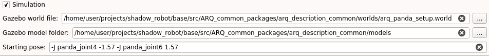

.. _make_simulation_compatible:
******************************
Running your robot with Gazebo
******************************

| GRIP features a simulation mode that allows you to quickly make sure that what you want to deploy works properly. We are going to explain in this page how to make sure you can use it with your robot. GRIP relies on `Gazebo <http://gazebosim.org/>`_, which is natively installed with ROS.
| **Disclaimer: The purpose of the simulation mode is mainly to make sure all components work as expected, not to provide a high performance simulation environment to develop new methods!**

Before starting
###############
| For now, the simulated controllers to actuate the joints of your robot must compatible with the `ROS control <http://wiki.ros.org/ros_control>`_ framework. So if you want to integrate your own controller, please follow this `tutorial <http://gazebosim.org/tutorials/?tut=ros_control>`_.
| Please note that you **must** have a MoveIt! configuration package for your robot to use GRIP's simulation mode. If you don't have one, you can find more details about how to create one :ref:`here <creating_moveit_config>`.
| You also **must** have Gazebo description files (i.e. a :code:`.world` file as well as a folder containing meshes and description of the objects to be spawned). If you need further information, see :ref:`here <creating_description_files>`.

Make your package Gazebo-compatible
###################################
| In order to use ROS controllers with your robot, you need to add some elements to your *urdf.xacro* file. Gazebo uses a specific element that links actuators to joints, called :code:`<transmission>`. Each of these elements must contain **at least**:
* :code:`<joint name= >`: which corresponds to the name of a defined joint in your urdf file that you want Gazebo to be able to actuate.
* :code:`<type>transmission_interface/SimpleTransmission</type>`: which specifies the type of transmission. More information `here <https://wiki.ros.org/urdf/XML/Transmission>`_.
* :code:`<hardwareInterface>` that should be present in both `<joint>` and `<actuator>` tags. It makes the *gazebo_ros_control* plugin aware of which hardware interface to load (position, velocity or effort interfaces).

The last step is to add the *gazebo_ros_control* plugin to the URDF file. The plugin should look like this:
.. code-block:: xml
    <gazebo>
      <plugin name="gazebo_ros_control" filename="libgazebo_ros_control.so">
        <!-- Optional - Default being the value of robot name in the urdf/sdf file-->
        <robotNamespace>my_name_space</robotNamespace>
        <!-- Optional - The period of the controller update (in seconds), default is Gazebo's period -->
        <controlPeriod>my_value</controlPeriod>
        <!-- Optional - The location of the robot_description (URDF) on the parameter server, default being '/robot_description' -->
        <robotParam>my_param_value</robotParam>
        <!-- Optional - The pluginlib name of a custom robot sim interface to be used (see below for more details), default being 'gazebo_ros_control/DefaultRobotHWSim' -->
        <robotSimType>my_value</robotSimType>
      </plugin>
    </gazebo>

You can find examples of URDF files containing these modifications `here <https://github.com/ARQ-CRISP/EZGripper/blob/d9164416ea18f8355b60514b961030b6b2a95703/ezgripper_driver/urdf/ezgripper_dual_articulated.urdf.xacro#L136>`_, `here <https://github.com/ARQ-CRISP/ARQ_common_packages/blob/0cbb7d2747ecce6d86119cd989e95eee9a3e1300/arq_robots/urdf/arq_ur5.urdf.xacro#L22>`_ and `here <https://github.com/ARQ-CRISP/franka_ros/blob/bdenoun/multi_modified_for_gazebo/franka_description/robots/panda.transmission.xacro>`_.

.. _set_simu_param:
Set the simulation parameters
#############################
1. Start GRIP: :code:`roslaunch grip_api start_framework.launch`
2. Leave :code:`simulation` ticked
3. Specify the Gazebo world file
4. Specify the associated folder containing all the models to be spawned
5. If you want your robot to start in a specific joint states, you can define it in the :code:`Starting pose` edit line (optional). The input **must** respect this formatting: :code:`-J <joint_name1> <value> -J <joint_name2> <value>`, as shown in the following image.

Now, if you follow this :ref:`tutorial <integrate_with_moveit>`, you should be able to run your robot in simulation with Gazebo.
