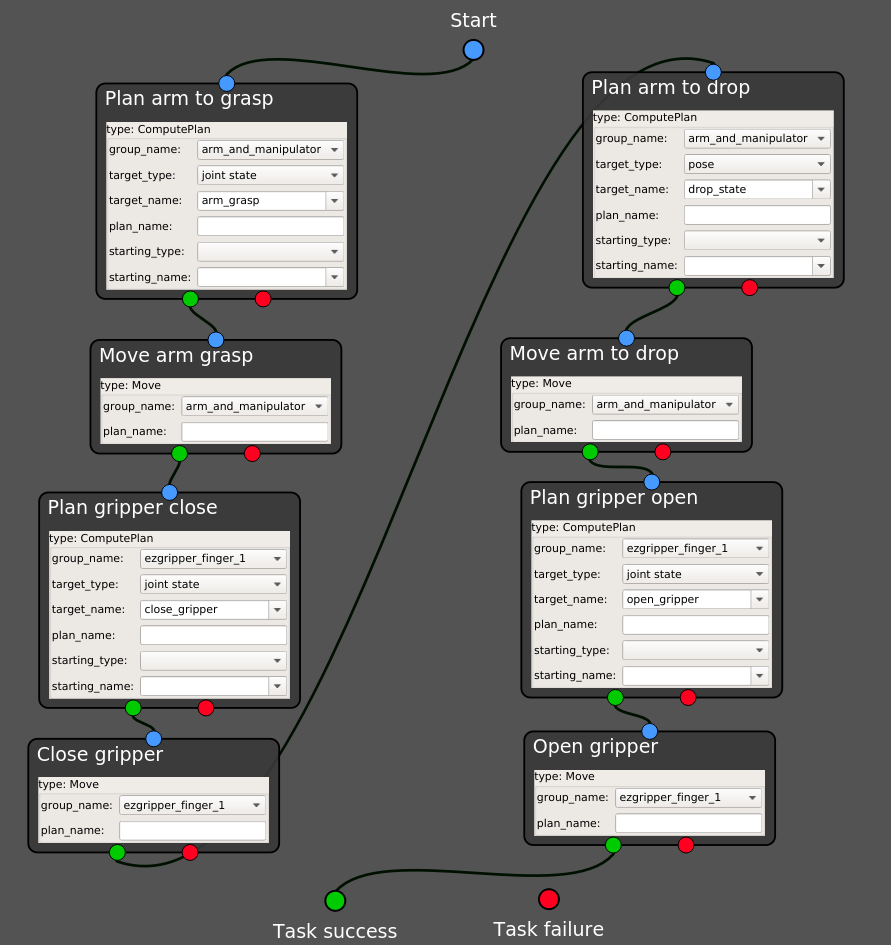
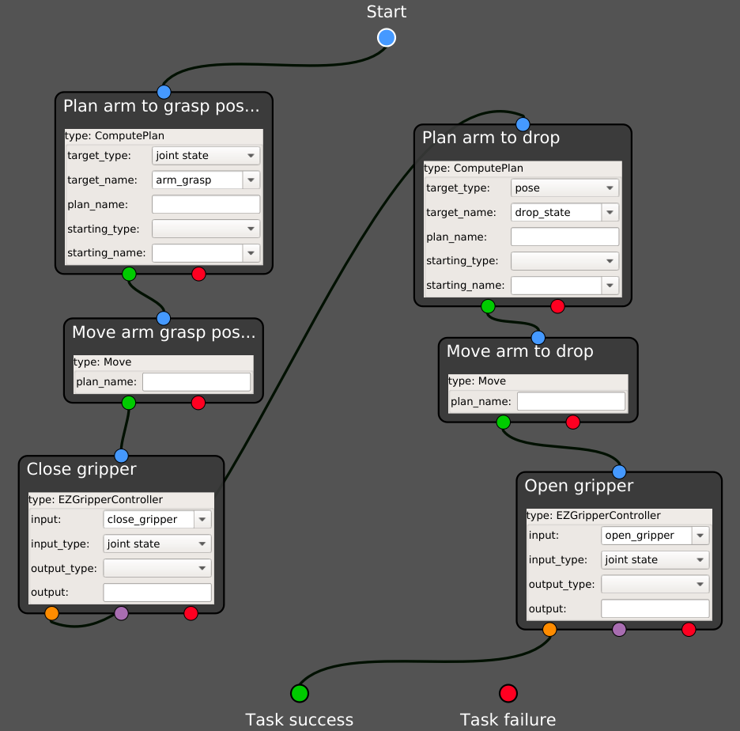

.. _automated_pick_place:
****************************************
Running an automated pick and place task
****************************************

| This page contains a step-by-step guide to design and execute automated pick and place in GRIP's task editor.
| This tutorial copes with automated (and not autonomous) tasks, therefore the robot will only move between poses or joint states already registered in GRIP's interface.

What you need before starting
#############################

A robot arm and gripper or hand integrated to GRIP, either :ref:`through MoveIt! <integrate_with_moveit>`, via a :ref:`launch file <integrate_with_launch>` or using :ref:`external software <integrate_software>` to control the hardware.

Prerequisites
#############

In order to illustrate the same example both when the robot is integrated through MoveIt! and when one part of the robot is controlled by an external controller, we are going to use a UR5 robot arm with a EZGripper. If you want to replicate this tutorial, please clone `this repository <https://github.com/ARQ-CRISP/arq_ur5_ezgripper_moveit_config.git>`_, `this one <https://github.com/ARQ-CRISP/EZGripper>`_ and `this one <https://github.com/ARQ-CRISP/ARQ_common_packages>`_ in :code:`/home/user/projects/shadow_robot/base/src`. Note that for the simulation of the EZGripper, you might want to clone this `repository <https://github.com/roboticsgroup/roboticsgroup_gazebo_plugins.git>`_ as well. Now, compile them:

.. prompt:: bash $

    cd /home/user/projects/shadow_robot/base
    catkin_make
    source devel/setup.bash

Pick and place with MoveIt! operating the full robot
####################################################
In this section, we are going to run our robot in simulation **because we cannot control the physical EZGripper via MoveIt!**. Note that if you can operate your physical robot through MoveIt!, you should follow similar steps!

1. Integrate your robot following :ref:`this tutorial <integrate_with_moveit>`. In our case, we have declared two planners, one for the group :code:`arm_and_manipulator` that will control the arm and the other one for :code:`ezgripper_finger_1`, that will control the gripper.
2. Define the joint states and/or poses that correspond to where the robot should move during the task. In order to illustrate the different features of the provided states, for this tutorial we defined 4 joint states and 1 pose as follow:
Named joint states:

.. code-block:: yaml

  arm_grasp:
    shoulder_pan_joint: 1.435950220551577
    shoulder_lift_joint: -1.1216608234917134
    elbow_joint: 1.6512809336516137
    wrist_1_joint: -2.0680473866253664
    wrist_2_joint: -1.5617962196319137
    wrist_3_joint: -0.04593322487126095

  open_gripper:
    ezgripper_knuckle_palm_L1_1: 0

  close_gripper:
    ezgripper_knuckle_palm_L1_1: 1.93

Named poses:

.. code-block:: yaml

  drop_state:
    reference_frame: world
    position: {x: 0.26725, y: 0.24347, z: 0.975}
    # You can change r,p,y to x,y,z,w for quaternion
    orientation: {x: 0.72173, y: -0.69127, z: 0.03176, w: -0.015492}

3. Launch the robot (you can either click on the :code:`Launch robot` button or use the shortcut :code:`Ctrl+l`)
4. In the :code:`Task editor` tab, you should see a set of states ready to be used. You can drag and drop them into the editor area. In this tutorial we are only going to use two of them: :code:`ComputePlan` and :code:`Move`.
5. Configure each state according to what you want to implement. Note that you can take the most of the dropdown lists to select registered poses and joint states.

6. Make sure all the sockets are properly connected. Note that to connect all the remaining sockets to the :code:`Task failure`, you can use your right click and select :code:`Connect free sockets`.
7. Right click and select :code:`Execute`. A window is going to prompt you for the name you want to give to the task. Once the new name provided, you should see the robot moving according to what you have just implemented!

Pick and place with MoveIt! and an external controller
######################################################
In this section, we are going to carry out exactly the same task as in the previous section, but with our physical robot. As a result, we are going to use MoveIt! to control our robot arm and an `external controller <https://github.com/ARQ-CRISP/EZGripper/blob/master/ezgripper_driver/controllers/joint_state_controller.py>`_ :ref:`wrapped into a ROS action <ros_actions>` to operate the gripper.

1. Integrate your robot following :ref:`this <integrate_software>` and :ref:`this tutorial <integrate_with_moveit>`. In our case, we keep the same MoveIt! configuration package but only register one MoveIt! planner for the group :code:`arm_and_manipulator`. In the :code:`Hand configuration` tab, we use the following configuration for the :code:`External controller` editor:

.. code-block:: yaml

  EZGripperController:
    file: /home/user/projects/shadow_robot/base/src/EZGripper/ezgripper_driver/controllers/joint_state_controller.py
    action/service: /home/user/projects/shadow_robot/base/src/EZGripper/ezgripper_driver/action/JointStateGripper.action
    server_name: joint_state_ezgripper_controller
    node_type: joint_state_controller.py
    number_outcomes: 2

2. Define your joint states and/or poses that correspond to where the robot should move during the task. In our case, we use exactly the same as the previous section.
3. Launch the robot (you can either click on the :code:`Launch robot` button or use the shortcut :code:`Ctrl+l`)
4. In the :code:`Task editor` tab, you should see a set of states ready to be used. You can drag and drop them into the editor area. In this tutorial we are going to use three of them: :code:`ComputePlan`, :code:`Move` and the state generated from the integrated controller (here :code:`EZGripperController`).
5. Configure each state according to what you want to implement. Note that you can still take the most of the dropdown lists in the generated states!

6. Make sure all the sockets are properly connected. Note that to connect all the remaining sockets to the :code:`Task failure`, you can use your right click and select :code:`Connect free sockets`.
7. Right click and select :code:`Execute`. A window is going to prompt you for the name you want to give to the task. Once the new name provided, you should see the robot moving according to what you have just implemented!

.. note::

	You don't have to use MoveIt! at all if you have your own controller and planner for the robot arm. The steps are mostly the same, except that you won't have the states :code:`ComputePlan` and :code:`Move` but the generated one running your own code!
