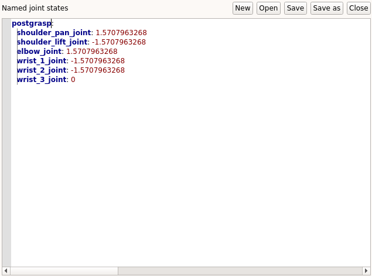
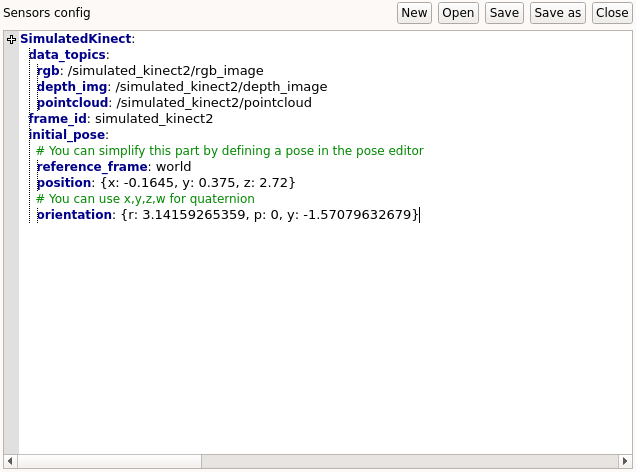
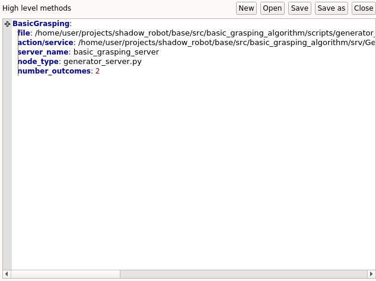
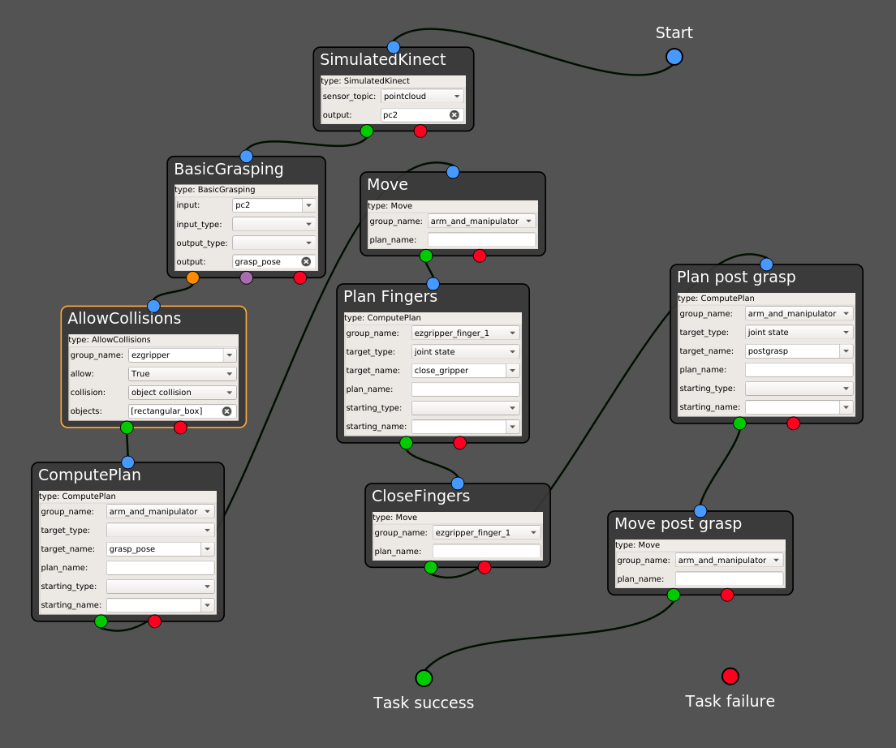
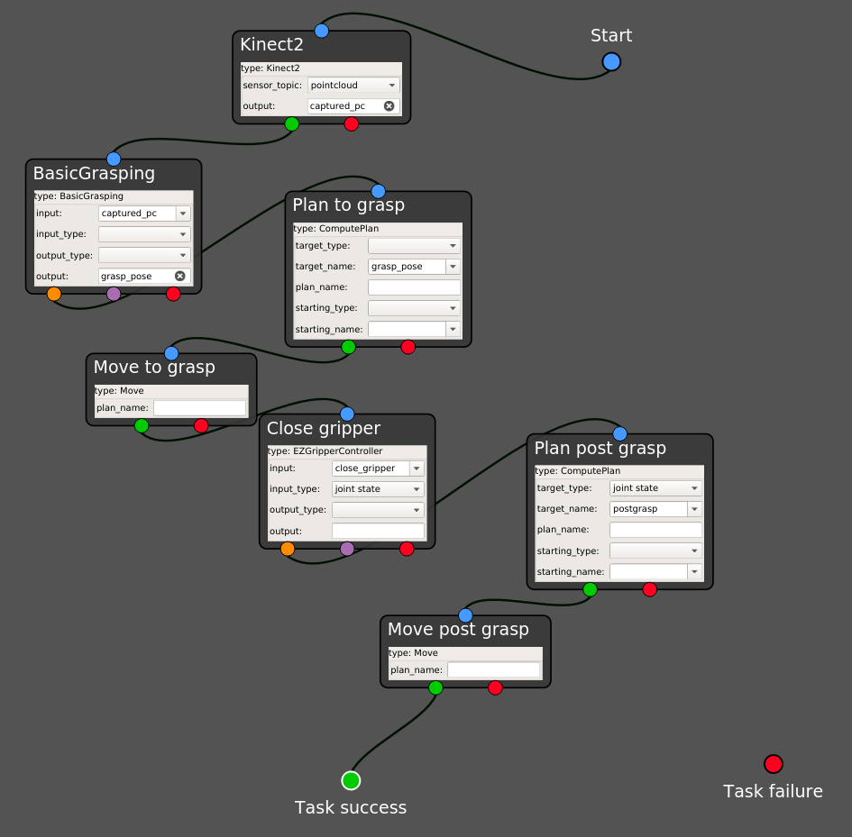

.. _autonomous_pick_place:
*****************************************
Running an autonomous pick and place task
*****************************************

| This page contains a step-by-step guide to design and execute autonomous pick and place in GRIP's task editor.
| In this tutorial, an integrated grasping algorithm will be run and will generate (from RGB-D data) a pose the robot must reach in order to grasp an unknown object laid on a table.

What you need before starting
#############################

A robot arm and gripper or hand integrated to GRIP, either :ref:`through MoveIt! <integrate_with_moveit>`, via a :ref:`launch file <integrate_with_launch>` or using :ref:`external software <integrate_software>` to control the hardware. You also need to have a :ref:`sensor integrated <integrate_sensor>` to GRIP.

Prerequisites
#############

In order to illustrate the same example both when the robot is integrated through MoveIt! and when one part of the robot is controlled by an external controller, we are going to use a UR5 robot arm with a EZGripper. If you want to replicate this tutorial, please clone `this repository <https://github.com/ARQ-CRISP/arq_ur5_ezgripper_moveit_config.git>`_, `this one <https://github.com/ARQ-CRISP/EZGripper>`_  and `this one <https://github.com/ARQ-CRISP/ARQ_common_packages>`_ :code:`/home/user/projects/shadow_robot/base/src`. Note that for the simulation of the EZGripper, you might want to clone this `repository <https://github.com/roboticsgroup/roboticsgroup_gazebo_plugins>`_ as well. In this tutorial, we are going to use a Kinect v2, so make sure to install `libfreenect2 <https://github.com/OpenKinect/libfreenect2/blob/master/README.md#linux>`_ and to follow these `instructions <https://github.com/code-iai/iai_kinect2#install>`_ (only for the physical robot). For the grasping algorithm, please clone this `repository <https://github.com/ARQ-CRISP/basic_grasping_algorithm.git>`_. Now, compile them:

.. prompt:: bash $

    cd /home/user/projects/shadow_robot/base
    catkin_make
    source devel/setup.bash

Simulating a depth sensor
*************************

In order to simulate the behavior of depth sensors, `this repository <https://github.com/ARQ-CRISP/ARQ_common_packages>`_ contains a Gazebo model that publishes all the topics such sensors would (e.g. RGB image, point cloud, etc.). Make sure to add this model in your **.world** file (see `here <https://github.com/ARQ-CRISP/ARQ_common_packages/blob/master/arq_description_common/worlds/arq_ur5_setup.world>`_ for an example).

Autonomous pick and place in simulation
#######################################
In this section, we are going to run our robot and sensor in simulation. In other words, the whole robot will be operated through MoveIt! (most of the steps are still valid if you can do it with your physical robot!).

1. Integrate your robot following :ref:`this tutorial <integrate_with_moveit>`. In our case, we have declared two planners, one for the group :code:`arm_and_manipulator` that will control the arm and the other one for :code:`ezgripper_finger_1`, that will control the gripper. Don't forget to add one sensor in the setup's composition.
2. If needed, define some waypoints (i.e. poses or joint states) your robot should reach during the task. In our case, we define a new joint state corresponding to the pose the robot should go to after grasping an object.

3. In the :code:`Setup configuration` tab, add a new sensor in the corresponding editor (see :ref:`here <integrate_sensor>` for more details). In our case, here is the configuration we used.

4. In the :code:`High level component` editor, please add the grasping algorithm you want to run. Make sure that it follows :ref:`the expected format <integrate_software>`. For the sake of simplicity, we are going to run a very simple algorithm. Its code can be found `here <https://github.com/ARQ-CRISP/basic_grasping_algorithm.git>`_.

5. Launch the robot (you can either click on the :code:`Launch robot` button or use the shortcut :code:`Ctrl+l`)
6. In order to spawn an object in the simulation environment, you can run the launch file we provide (in another terminal), which takes care of collisions and adding it to the MoveIt! scene

.. prompt:: bash $

  roslaunch grip_api manage_object.launch object_type:=rectangular_box object_position:="0 0.45 0.86" object_rpy_orientation:="0 0 0.28"

7. In the :code:`Task editor` tab, you should see a set of states ready to be used (among them, one with the name of your sensor). You can drag and drop them into the editor area.
8. Configure each state according to what you want to implement. Note that you can still take the most of the dropdown lists in the generated states!

9. Right click and select :code:`Execute`. A window is going to prompt you for the name you want to give to the task. Once the new name provided, you should see the robot autonomously picking the object and going to the pose you defined!

.. note::

	You might observe unrealistic behaviors when the gripper is in contact with the object (e.g. object slipping or even flying). You can partially improve this by tuning the physics parameters and change the controller you use in simulation. However, the main purpose of the simulation mode of GRIP is to make sure that the workflow works, not to simulate realistic contact interaction.

Autonomous pick and place with MoveIt! and an external controller
#################################################################
In this section, we are going to carry out exactly the same task as in the previous section, but with our physical robot. As a result, we are going to use MoveIt! to control our robot arm and an `external controller <https://github.com/ARQ-CRISP/EZGripper/blob/master/ezgripper_driver/controllers/joint_state_controller.py>`_ :ref:`wrapped into a ROS action <ros_actions>` to operate the gripper.

1. Integrate your robot following :ref:`this <integrate_software>` and :ref:`this tutorial <integrate_with_moveit>`. In our case, we keep the same MoveIt! configuration package but only register one MoveIt! planner for the group :code:`arm_and_manipulator`. In the :code:`Hand configuration` tab, we use the following configuration for the :code:`External controller` editor:

.. code-block:: yaml

  EZGripperController:
    file: /home/user/projects/shadow_robot/base/src/EZGripper/ezgripper_driver/controllers/joint_state_controller.py
    action/service: /home/user/projects/shadow_robot/base/src/EZGripper/ezgripper_driver/action/JointStateGripper.action
    server_name: joint_state_ezgripper_controller
    node_type: joint_state_controller.py
    number_outcomes: 2

2. Define your joint states and/or poses that correspond to where the robot should move during the task. In our case, we use exactly the same as the previous section.
3. In the :code:`Setup configuration` tab, add a new sensor in the corresponding editor (see :ref:`here <integrate_sensor>` for more details). In our case, here is the configuration we used.

.. image:: ../../img/real_kinect_config.png

4. In the :code:`High level component` editor, add the grasping algorithm you want to run (we will use exactly the same configuration as above).
5. Launch the robot (you can either click on the :code:`Launch robot` button or use the shortcut :code:`Ctrl+l`)
6. In the :code:`Task editor` tab, you should see a set of states ready to be used. You can drag and drop them into the editor area.

7. Make sure all the sockets are properly connected. Note that to connect all the remaining sockets to the :code:`Task failure`, you can use your right click and select :code:`Connect free sockets`.
8. Right click and select :code:`Execute`. A window is going to prompt you for the name you want to give to the task. Once the new name provided, you should see your robot executing autonomous picking.

.. note::

	You don't have to use MoveIt! at all if you have your own controller and planner for the robot arm. The steps are mostly the same, except that you won't have the states :code:`ComputePlan` and :code:`Move` but the generated one running your own code!
