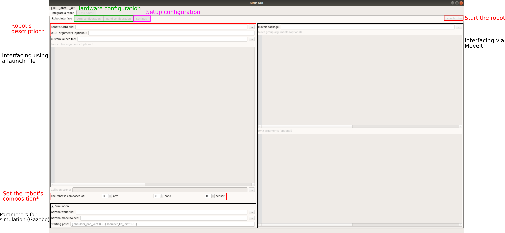
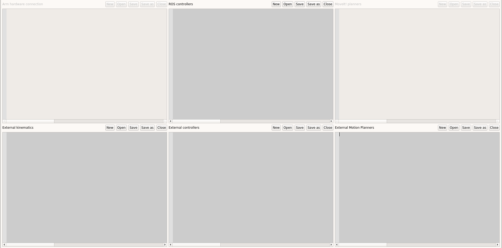
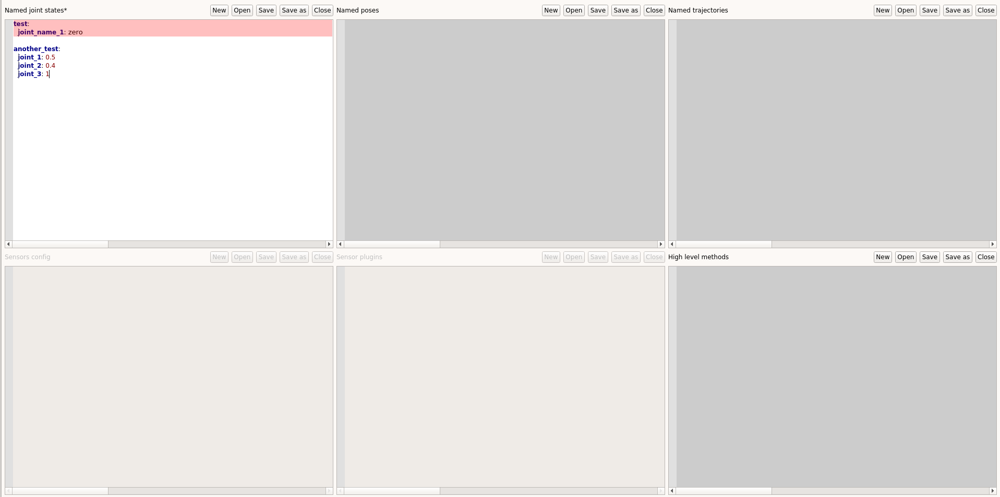

***************
Getting started
***************

This page introduces the different notions and steps required to start working with GRIP.

Getting familiar with the environment
#####################################

| As specified in the :ref:`instructions to install GRIP <install-instructions>`, the framework is deployed using `Docker <https://docs.docker.com/get-started/overview/>`_.
| If it's the first time you are hearing about docker and you want to know more about it, we advise you to read this `simplified explanation <https://medium.com/free-code-camp/docker-simplified-96639a35ff36#06d9>`_. In a nutshell, you can work in the Terminator window that pops up when you start the container without worrying about corrupting your native Ubuntu session (and that's pretty nice!).
| The container that you have installed is running Ubuntu 16.04, i.e. all the software that you can find natively on a fresh install of Ubuntu are there as well. And good news, the full ROS Kinetic stack is already installed for you! So you don't need to install MoveIt! or any other software that is installed with ROS.
| Note that instead of using the default **Gazebo 7.x**, GRIP natively runs **Gazebo 9.x**.

How to navigate inside the container
************************************
| When the Terminator window opens, you will be located at :code:`/home/user/`. From this point, you can use all the classic bash commands to navigate within the file system (e.g. :code:`cd`, :code:`ls`, :code:`mv`, etc.).
| To move directly to the catkin workspace, you can run

.. prompt:: bash $

    cd projects/shadow_robot/base

or

.. prompt:: bash $

    roscd && cd ..

A catkin workspace is a folder where you modify, build and install ROS packages. It must contain three folders:

- **src**: must contain the different ROS packages to build and run
- **devel**: development space
- **build**: build space

No need to worry, everything has already been set up for you and is ready to be used without further knowledge. However, if you want to know more about catkin and workspaces, you can find more `here <http://wiki.ros.org/catkin/conceptual_overview>`_ and `here <http://wiki.ros.org/catkin/workspaces>`_.

What is already there
*********************
| If you are having a look at what is inside the **src** folder of the catkin workspace, don't be scared if you only see the folder :code:`grip`, you will be able to install a lot of other ROS packages along with it. In fact, we made this container as *plain* as possible to avoid any confusion and potential conflict.
| This gives you the freedom to install whatever you want inside your container. For instance, if you want to test a work that relies on specific simualtors such as `MuJoCo <http://www.mujoco.org/>`_, you can install them without any additional overhead.
| We haven't included any additional and fancy text editor or IDEs, so everyone can install its favorite one (e.g. `Visual Studio Code <https://code.visualstudio.com/>`_, `JetBrains IDEs <https://www.jetbrains.com/>`_, `atom <https://atom.io/>`_, etc.).

What is GRIP
############

| GRIP is a ROS-based robot-agnostic software that allows for visual programming and fast prototyping of robotic grasping and manipulation tasks. The main purpose of this tool is to facilitate the integration of software and hardware components into complex robotic systems.
| Although the Robot Operating System (ROS) is not the only middleware available to operate robots, it remains one of the most used, especially in academia. For this reason, instead of re-implementing numerous features already provided by this operating system, we decided to make the most of it.
| If you've never used ROS and are reluctant to thoroughly learn this stack, GRIP is made for you. In fact, we tried to reduce as much as possible the ROS knowledge required to use our framework, to make sure GRIP remains accessible and easy to use. In addition, we provide a documentation with several examples for all the steps from robot integration to task design and execution.
| In order to simplify all the steps necessary to run a robot task, we have implemented an intuitive and reactive Graphical User Interface (GUI) for both the integration stage and task design. If you want to have a look at the code, all related files are located in the `grip_api <https://github.com/shadow-robot/sr_grip/tree/kinetic-devel/grip_api>`_ package. The code corresponding to all the other components of this fraemwork, can be found in the `grip_core <https://github.com/shadow-robot/sr_grip/tree/kinetic-devel/grip_core>`_ package. Let's now have a quick overview of the different steps required to run a task with GRIP.
| **Disclaimer: GRIP's focus is not to be highly performant, but rather to provide users a tool to easily reproduce their own setups and integrate components to screen them, before potentially integrating them to their existing optimised pipeline!**

Integration stage
*****************
| Interfacing a robot is the first step required to program it. For this reason, GRIP features several non-exclusive integration modalities allowing you to re-use already existing components, and thus saving you time. If you start from scratch, no worries, the other pages of the documentation should greatly help you!
| Before going into more details in the :ref:`tutorials <tutorials_list>`, we provide here a quick overview of the GUI specifically dedicated to help you interfacing hardware and/or software. In order to start GRIP, you first need to run

.. prompt:: bash $

    roslaunch grip_api start_framework.launch

You should have the following GUI appearing (without the annotations obviously).

| Please note that the launch button is here **disabled** and will become **enabled** only when a robot has been successfully integrated! This should help you save quite some time trying to start your robot while it's going to fail because something is missing...
| The black areas correspond to optional robot's interfacing modalities, that are going to be detailed in the tutorials.
| The two areas on the left (i.e. **Robot's description**, **Robot's composition**) are required regardless of the modalities you want to use to interface your robot. Depending on the composition of your robot, the appropriate hardware configuration tabs (area in green) will become available. Here is what such tabs look like

| In order to configure a robot arm (or hand/gripper), you need to specify several components, e.g. which controller, kinematics library and planner to use to operate it. In the above image, you can see that two areas are grayed out (i.e. disabled), and that's fine, it means that the current configuration does not allow the user to set these fields. In other words, we have implemented a reactive mechanism that enables/disables the different fields according to the current inputs to help you configure the robot. For instance, the :code:`MoveIt! planners` editor will be available if and only if a MoveIt! configuration package has been previously provided.
| For each editor, you can either open existing **YAML** configuration files or create your own via the push buttons you can see. Once done, if you want to integrate a controller you have implemented yourself, you can just press the ``+`` symbol that appears in the margin. A sequence of dialogues pop up and if you follow them, your component will be successfully integrated to GRIP. More details about this process can be found in the tutorials.
| Each editor has a live syntax check that will signal you whether some information you provided don't follow the expected format. For instance, as illustrated in the following figure, the editor :code:`Named joint states` of the :code:`Settings` tab shows an error. In fact, the value corresponding to the joint *joint_name_1* should be an integer or float, not a string. Such mechanism, along with autocompletion should help you to efficiently interface and configure your robot.

Once you have configured everything you need, you can start designing your task!

Task design and execution
*************************
**Overview coming soon, stay tuned!**

If everything is clear so far, you can move to the :ref:`tutorials <tutorials_list>`.
